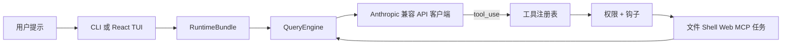

<h1 align="center">&nbsp; <code>oh</code> — OpenHarness：开放智能体运行框架</h1>

**OpenHarness** 提供核心轻量级智能体基础设施：工具调用、技能系统、记忆管理和多智能体协调。

**加入社区**：一起为开放智能体开发贡献 **Harness**。

<p align="center">
  <a href="#-快速开始"></a>
  <a href="#%EF%B8%8F-harness-架构"></a>
  <a href="#-特性"></a>
  <a href="#-测试结果"></a>
  <a href="https://github.com/HKUDS/OpenHarness/blob/main/LICENSE"></a>
</p>

<p align="center">
  
  
  
  
  
  <a href="https://github.com/HKUDS/OpenHarness/actions/workflows/ci.yml"></a>
  <a href="https://github.com/HKUDS/.github/blob/main/profile/README.md"></a>
  <a href="https://github.com/HKUDS/.github/blob/main/profile/README.md"></a>
</p>

一条命令（**oh**）启动 **OpenHarness**，解锁全部智能体运行框架能力。

支持 CLI 智能体集成，包括 OpenClaw、nanobot、Cursor 等。

<p align="center">
  
</p>

<p align="center">
  
</p>

---
## ✨ OpenHarness 核心 Harness 特性

<table align="center" width="100%">
<tr>
<td width="20%" align="center" style="vertical-align: top; padding: 15px;">

<h3>🔄 智能体循环</h3>

<div align="center">
  
</div>


<p align="center"><strong>• 流式工具调用循环</strong></p>
<p align="center"><strong>• API 指数退避重试</strong></p>
<p align="center"><strong>• 并行工具执行</strong></p>
<p align="center"><strong>• Token 计数与费用追踪</strong></p>

</td>
<td width="20%" align="center" style="vertical-align: top; padding: 15px;">

<h3>🔧 Harness 工具箱</h3>

<div align="center">
  
</div>


<p align="center"><strong>• 43 个工具（文件、Shell、搜索、Web、MCP）</strong></p>
<p align="center"><strong>• 按需加载技能（.md）</strong></p>
<p align="center"><strong>• 插件生态（技能 + 钩子 + 智能体）</strong></p>
<p align="center"><strong>• 兼容 anthropics/skills 和插件</strong></p>

</td>
<td width="20%" align="center" style="vertical-align: top; padding: 15px;">

<h3>🧠 上下文与记忆</h3>

<div align="center">
  
</div>


<p align="center"><strong>• CLAUDE.md 发现与注入</strong></p>
<p align="center"><strong>• 上下文压缩（自动精简）</strong></p>
<p align="center"><strong>• MEMORY.md 持久化记忆</strong></p>
<p align="center"><strong>• 会话恢复与历史记录</strong></p>

</td>
<td width="20%" align="center" style="vertical-align: top; padding: 15px;">

<h3>🛡️ 安全治理</h3>

<div align="center">
  
</div>


<p align="center"><strong>• 多级权限模式</strong></p>
<p align="center"><strong>• 路径级与命令级规则</strong></p>
<p align="center"><strong>• PreToolUse / PostToolUse 钩子</strong></p>
<p align="center"><strong>• 交互式审批对话框</strong></p>

</td>
<td width="20%" align="center" style="vertical-align: top; padding: 15px;">

<h3>🤝 集群协调</h3>

<div align="center">
  
</div>


<p align="center"><strong>• 子智能体生成与任务委派</strong></p>
<p align="center"><strong>• 团队注册与任务管理</strong></p>
<p align="center"><strong>• 后台任务生命周期</strong></p>
<p align="center"><strong>• <a href="https://github.com/HKUDS/ClawTeam">ClawTeam</a> 集成（路线图）</strong></p>

</td>
</tr>
</table>

---

## 🤔 什么是智能体运行框架（Agent Harness）？

**Agent Harness** 是围绕大语言模型（LLM）构建的完整基础设施，使其成为功能完备的智能体。模型提供智能，框架提供**双手、眼睛、记忆和安全边界**。

<p align="center">
  
</p>

OpenHarness 是一个开源 Python 实现，面向**研究者、开发者和社区**设计：

- **理解** 生产级 AI 智能体底层的工作原理
- **实验** 前沿的工具、技能和智能体协调模式
- **扩展** 框架，添加自定义插件、提供商和领域知识
- **构建** 基于成熟架构的专用智能体

---

## 📰 最新动态

- **2026-04-01** 🎨 **v0.1.0** — **OpenHarness** 首次开源发布，包含完整 Harness 架构：

<p align="center">
  <strong>从这里开始：</strong>
  <a href="#-快速开始">快速开始</a> ·
  <a href="#-提供商兼容性">提供商兼容性</a> ·
  <a href="https://github.com/HKUDS/OpenHarness/blob/main/docs/SHOWCASE.md">案例展示</a> ·
  <a href="https://github.com/HKUDS/OpenHarness/blob/main/CONTRIBUTING.md">贡献指南</a> ·
  <a href="https://github.com/HKUDS/OpenHarness/blob/main/CHANGELOG.md">更新日志</a>
</p>

---

## 🚀 快速开始

### 一键安装

最快的上手方式 — 一条命令自动处理操作系统检测、依赖检查和安装：

```bash
curl -fsSL https://raw.githubusercontent.com/HKUDS/OpenHarness/main/scripts/install.sh | bash
```

**可选参数：**

| 参数 | 说明 |
|------|------|
| `--from-source` | 从 GitHub 克隆并以可编辑模式安装（`pip install -e .`） |
| `--with-channels` | 同时安装 IM 通道依赖（`slack-sdk`、`python-telegram-bot`、`discord.py`） |

```bash
# 从源码安装（适合贡献者 / 获取最新代码）
curl -fsSL https://raw.githubusercontent.com/HKUDS/OpenHarness/main/scripts/install.sh | bash -s -- --from-source

# 安装并包含 IM 通道支持
curl -fsSL https://raw.githubusercontent.com/HKUDS/OpenHarness/main/scripts/install.sh | bash -s -- --with-channels

# 或者克隆后本地运行
bash scripts/install.sh --from-source --with-channels
```

脚本将会：
1. 检测你的操作系统（Linux / macOS / WSL）
2. 验证 Python ≥ 3.10 和 Node.js ≥ 18
3. 通过 `pip` 安装 OpenHarness
4. 如果有 Node.js，设置 React TUI（`npm install`）
5. 创建 `~/.openharness/` 配置目录
6. 通过 `oh --version` 确认安装成功

### 前置要求

- **Python 3.10+** 和 [uv](https://docs.astral.sh/uv/)
- **Node.js 18+**（可选，用于 React 终端 UI）
- 一个 LLM API 密钥

### 一条命令演示

```bash
ANTHROPIC_API_KEY=your_key uv run oh -p "检查这个仓库并列出前 3 个重构建议"
```

### 安装与运行

```bash
# 克隆并安装
git clone https://github.com/HKUDS/OpenHarness.git
cd OpenHarness
uv sync --extra dev

# 示例：使用 Kimi 作为后端
export ANTHROPIC_BASE_URL=https://api.moonshot.cn/anthropic
export ANTHROPIC_API_KEY=your_kimi_api_key
export ANTHROPIC_MODEL=kimi-k2.5

# 启动
oh                    # 如果已激活虚拟环境
uv run oh             # 不激活虚拟环境
```

<p align="center">
  
</p>

### 非交互模式（管道与脚本）

```bash
# 单次提示 → 标准输出
oh -p "解释这个代码库"

# JSON 输出，适合程序化使用
oh -p "列出 main.py 中的所有函数" --output-format json

# 实时流式 JSON 事件
oh -p "修复这个 bug" --output-format stream-json
```

## 🔌 提供商兼容性

OpenHarness 支持三种 API 格式：**Anthropic**（默认）、**OpenAI 兼容**（`--api-format openai`）和 **GitHub Copilot**（`--api-format copilot`）。OpenAI 格式覆盖了广泛的提供商。

### Anthropic 格式（默认）

| 提供商配置 | 检测信号 | 说明 |
|-----------|---------|------|
| **Anthropic** | 未设置自定义 `ANTHROPIC_BASE_URL` 时默认 | 默认 Claude 设置 |
| **Moonshot / Kimi** | `ANTHROPIC_BASE_URL` 包含 `moonshot` 或模型以 `kimi` 开头 | Anthropic 兼容端点 |
| **Vertex 兼容** | Base URL 包含 `vertex` 或 `aiplatform` | Vertex 上的 Anthropic 风格网关 |
| **Bedrock 兼容** | Base URL 包含 `bedrock` | Bedrock 风格部署 |
| **通用 Anthropic 兼容** | 其他任何显式 `ANTHROPIC_BASE_URL` | 代理和内部网关 |

### OpenAI 格式（`--api-format openai`）

任何实现了 OpenAI `/v1/chat/completions` API 的提供商均可开箱即用：

| 提供商 | Base URL | 示例模型 |
|--------|----------|---------|
| **阿里云 DashScope** | `https://dashscope.aliyuncs.com/compatible-mode/v1` | `qwen3.5-flash`、`qwen3-max`、`deepseek-r1` |
| **DeepSeek** | `https://api.deepseek.com` | `deepseek-chat`、`deepseek-reasoner` |
| **OpenAI** | `https://api.openai.com/v1` | `gpt-4o`、`gpt-4o-mini` |
| **GitHub Models** | `https://models.inference.ai.azure.com` | `gpt-4o`、`Meta-Llama-3.1-405B-Instruct` |
| **SiliconFlow** | `https://api.siliconflow.cn/v1` | `deepseek-ai/DeepSeek-V3` |
| **Groq** | `https://api.groq.com/openai/v1` | `llama-3.3-70b-versatile` |
| **Ollama（本地）** | `http://localhost:11434/v1` | 任意本地模型 |

```bash
# 示例：使用 DashScope
uv run oh --api-format openai \
  --base-url "https://dashscope.aliyuncs.com/compatible-mode/v1" \
  --api-key "sk-xxx" \
  --model "qwen3.5-flash"

# 或通过环境变量
export OPENHARNESS_API_FORMAT=openai
export OPENAI_API_KEY=[REDACTED:api-key]
export OPENHARNESS_BASE_URL=https://dashscope.aliyuncs.com/compatible-mode/v1
export OPENHARNESS_MODEL=qwen3.5-flash
uv run oh
```

### GitHub Copilot 格式（`--api-format copilot`）

使用你现有的 GitHub Copilot 订阅作为 LLM 后端。认证使用 GitHub 的 OAuth 设备流 — 无需 API 密钥。

```bash
# 一次性登录（打开浏览器进行 GitHub 授权）
oh auth copilot-login

# 然后使用 Copilot 作为提供商启动
uv run oh --api-format copilot

# 或通过环境变量
export OPENHARNESS_API_FORMAT=copilot
uv run oh

# 查看认证状态
oh auth status

# 移除已存储的凭证
oh auth copilot-logout
```

| 功能 | 详情 |
|------|------|
| **认证方式** | GitHub OAuth 设备流（无需 API 密钥） |
| **令牌管理** | 自动刷新短期会话令牌 |
| **企业版** | 通过 `--github-domain` 参数支持 GitHub Enterprise |
| **模型** | 使用 Copilot 默认模型选择 |
| **API** | 底层为 OpenAI 兼容的 Chat Completions |

---

## 🏗️ Harness 架构

OpenHarness 通过 10 个子系统实现核心 Agent Harness 模式：

```
openharness/
  engine/          # 🧠 智能体循环 — 查询 → 流式 → 工具调用 → 循环
  tools/           # 🔧 43 个工具 — 文件 I/O、Shell、搜索、Web、MCP
  skills/          # 📚 知识系统 — 按需加载技能（.md 文件）
  plugins/         # 🔌 扩展 — 命令、钩子、智能体、MCP 服务器
  permissions/     # 🛡️ 安全 — 多级模式、路径规则、命令拒绝
  hooks/           # ⚡ 生命周期 — PreToolUse/PostToolUse 事件钩子
  commands/        # 💬 54 个命令 — /help、/commit、/plan、/resume 等
  mcp/             # 🌐 MCP — Model Context Protocol 客户端
  memory/          # 🧠 记忆 — 持久化跨会话知识
  tasks/           # 📋 任务 — 后台任务管理
  coordinator/     # 🤝 多智能体 — 子智能体生成、团队协调
  prompts/         # 📝 上下文 — 系统提示词组装、CLAUDE.md、技能
  config/          # ⚙️ 设置 — 多层配置、迁移
  ui/              # 🖥️ React TUI — 后端协议 + 前端
```

### 智能体循环

框架的核心。一个循环，无限可组合：

```python
while True:
    response = await api.stream(messages, tools)
    
    if response.stop_reason != "tool_use":
        break  # 模型完成
    
    for tool_call in response.tool_uses:
        # 权限检查 → 钩子 → 执行 → 钩子 → 结果
        result = await harness.execute_tool(tool_call)
    
    messages.append(tool_results)
    # 循环继续 — 模型看到结果，决定下一步行动
```

模型决定**做什么**。框架处理**怎么做** — 安全、高效、全面可观测。

### Harness 流程



---

## ✨ 特性

### 🔧 工具（43+）

| 类别 | 工具 | 说明 |
|------|------|------|
| **文件 I/O** | Bash、Read、Write、Edit、Glob、Grep | 带权限检查的核心文件操作 |
| **搜索** | WebFetch、WebSearch、ToolSearch、LSP | Web 和代码搜索能力 |
| **笔记本** | NotebookEdit | Jupyter 笔记本单元格编辑 |
| **智能体** | Agent、SendMessage、TeamCreate/Delete | 子智能体生成与协调 |
| **任务** | TaskCreate/Get/List/Update/Stop/Output | 后台任务管理 |
| **MCP** | MCPTool、ListMcpResources、ReadMcpResource | Model Context Protocol 集成 |
| **模式** | EnterPlanMode、ExitPlanMode、Worktree | 工作流模式切换 |
| **调度** | CronCreate/List/Delete、RemoteTrigger | 定时与远程执行 |
| **元操作** | Skill、Config、Brief、Sleep、AskUser | 知识加载、配置、交互 |

每个工具都具备：
- **Pydantic 输入验证** — 结构化、类型安全的输入
- **自描述 JSON Schema** — 模型自动理解工具
- **权限集成** — 每次执行前检查
- **钩子支持** — PreToolUse/PostToolUse 生命周期事件

### 📚 技能系统

技能是**按需加载的知识** — 仅在模型需要时加载：

```
可用技能：
- commit：创建简洁、结构良好的 git 提交
- review：审查代码中的 bug、安全问题和质量
- debug：系统性地诊断和修复 bug
- plan：在编码前设计实施方案
- test：为代码编写和运行测试
- simplify：重构代码使其更简洁、更易维护
- pdf：使用 pypdf 处理 PDF（来自 anthropics/skills）
- xlsx：Excel 操作（来自 anthropics/skills）
- ... 40+ 更多
```

**兼容 [anthropics/skills](https://github.com/anthropics/skills)** — 只需将 `.md` 文件复制到 `~/.openharness/skills/`。

### 🔌 插件系统

**兼容 [claude-code 插件](https://github.com/anthropics/claude-code/tree/main/plugins)**。已测试 12 个官方插件：

| 插件 | 类型 | 功能 |
|------|------|------|
| `commit-commands` | 命令 | Git 提交、推送、PR 工作流 |
| `security-guidance` | 钩子 | 文件编辑时的安全警告 |
| `hookify` | 命令 + 智能体 | 创建自定义行为钩子 |
| `feature-dev` | 命令 | 功能开发工作流 |
| `code-review` | 智能体 | 多智能体 PR 审查 |
| `pr-review-toolkit` | 智能体 | 专业化 PR 审查智能体 |

```bash
# 管理插件
oh plugin list
oh plugin install <source>
oh plugin enable <name>
```

### 🤝 生态系统工作流

OpenHarness 适合作为围绕 Claude 风格工具约定的轻量级框架层：

- **面向 OpenClaw 的工作流** 可以复用 Markdown 优先的知识和命令驱动的协作模式。
- **Claude 风格的插件和技能** 保持可移植性，因为 OpenHarness 维护了这些熟悉的格式。
- **ClawTeam 风格的多智能体工作** 可以很好地映射到内置的团队、任务和后台执行原语。

具体的使用场景而非笼统的描述，请参见 [`docs/SHOWCASE.md`](https://github.com/HKUDS/OpenHarness/blob/main/docs/SHOWCASE.md)。

### 🛡️ 权限系统

多级安全机制，细粒度控制：

| 模式 | 行为 | 适用场景 |
|------|------|---------|
| **默认** | 写入/执行前询问 | 日常开发 |
| **自动** | 允许所有操作 | 沙箱环境 |
| **计划模式** | 阻止所有写入 | 大型重构，先审查 |

在 `settings.json` 中配置**路径级规则**：
```json
{
  "permission": {
    "mode": "default",
    "path_rules": [{"pattern": "/etc/*", "allow": false}],
    "denied_commands": ["rm -rf /", "DROP TABLE *"]
  }
}
```

### 🖥️ 终端 UI

基于 React/Ink 的 TUI，提供完整的交互体验：

- **命令选择器**：输入 `/` → 方向键选择 → 回车确认
- **权限对话框**：交互式 y/n，显示工具详情
- **模式切换器**：`/permissions` → 从列表中选择
- **会话恢复**：`/resume` → 从历史记录中选取
- **动画加载器**：工具执行期间的实时反馈
- **键盘快捷键**：底部显示，上下文感知

### 📡 CLI

```
oh [选项] 命令 [参数]

会话:       -c/--continue, -r/--resume, -n/--name
模型:       -m/--model, --effort, --max-turns
输出:       -p/--print, --output-format text|json|stream-json
权限:       --permission-mode, --dangerously-skip-permissions
上下文:     -s/--system-prompt, --append-system-prompt, --settings
高级:       -d/--debug, --mcp-config, --bare

子命令: oh mcp | oh plugin | oh auth
```

---

## 📊 测试结果

| 测试套件 | 测试数 | 状态 |
|---------|--------|------|
| 单元 + 集成测试 | 114 | ✅ 全部通过 |
| CLI 参数 E2E | 6 | ✅ 真实模型调用 |
| Harness 功能 E2E | 9 | ✅ 重试、技能、并行、权限 |
| React TUI E2E | 3 | ✅ 欢迎界面、对话、状态 |
| TUI 交互 E2E | 4 | ✅ 命令、权限、快捷键 |
| 真实技能 + 插件 | 12 | ✅ anthropics/skills + claude-code/plugins |

```bash
# 运行所有测试
uv run pytest -q                           # 114 单元/集成测试
python scripts/test_harness_features.py     # Harness E2E
python scripts/test_real_skills_plugins.py  # 真实插件 E2E
```

---

## 🔧 扩展 OpenHarness

### 添加自定义工具

```python
from pydantic import BaseModel, Field
from openharness.tools.base import BaseTool, ToolExecutionContext, ToolResult

class MyToolInput(BaseModel):
    query: str = Field(description="搜索查询")

class MyTool(BaseTool):
    name = "my_tool"
    description = "执行一些有用的操作"
    input_model = MyToolInput

    async def execute(self, arguments: MyToolInput, context: ToolExecutionContext) -> ToolResult:
        return ToolResult(output=f"查询结果: {arguments.query}")
```

### 添加自定义技能

创建 `~/.openharness/skills/my-skill.md`：

```markdown
---
name: my-skill
description: 针对特定领域的专家指导
---

# 我的技能

## 何时使用
当用户询问关于 [你的领域] 的问题时使用。

## 工作流
1. 第一步
2. 第二步
...
```

### 添加插件

创建 `.openharness/plugins/my-plugin/.claude-plugin/plugin.json`：

```json
{
  "name": "my-plugin",
  "version": "1.0.0",
  "description": "我的自定义插件"
}
```

在 `commands/*.md` 中添加命令，在 `hooks/hooks.json` 中添加钩子，在 `agents/*.md` 中添加智能体。

---

## 🌍 案例展示

OpenHarness 最适合作为一个小型、可审查的框架，适配到实际工作流中：

- **仓库编码助手**：用于阅读代码、打补丁和本地运行检查。
- **无头脚本工具**：在自动化流程中使用 `json` 和 `stream-json` 输出。
- **插件与技能测试平台**：用于实验 Claude 风格的扩展。
- **多智能体原型框架**：用于任务委派和后台执行。
- **提供商对比沙箱**：跨 Anthropic 兼容后端的比较。

更多简短、可复现的示例请参见 [`docs/SHOWCASE.md`](https://github.com/HKUDS/OpenHarness/blob/main/docs/SHOWCASE.md)。

---

## 🤝 参与贡献

OpenHarness 是一个**社区驱动的研究项目**。我们欢迎以下方面的贡献：

| 领域 | 示例 |
|------|------|
| **工具** | 面向特定领域的新工具实现 |
| **技能** | 领域知识 `.md` 文件（金融、科学、DevOps 等） |
| **插件** | 包含命令、钩子、智能体的工作流插件 |
| **提供商** | 支持更多 LLM 后端（OpenAI、Ollama 等） |
| **多智能体** | 协调协议、团队模式 |
| **测试** | E2E 场景、边界情况、基准测试 |
| **文档** | 架构指南、教程、翻译 |

```bash
# 开发环境设置
git clone https://github.com/HKUDS/OpenHarness.git
cd OpenHarness
uv sync --extra dev
uv run pytest -q  # 验证一切正常
```

实用的贡献者入口：

- [`CONTRIBUTING.md`](https://github.com/HKUDS/OpenHarness/blob/main/CONTRIBUTING.md) — 设置、检查和 PR 要求
- [`CHANGELOG.md`](https://github.com/HKUDS/OpenHarness/blob/main/CHANGELOG.md) — 用户可见的变更
- [`docs/SHOWCASE.md`](https://github.com/HKUDS/OpenHarness/blob/main/docs/SHOWCASE.md) — 值得记录的真实使用模式

---

## 📄 许可证

MIT — 详见 [LICENSE](https://github.com/HKUDS/OpenHarness/blob/main/LICENSE)。

---

<p align="center">
  
  <br>
  <strong>Oh my Harness!</strong>
  <br>
  <em>模型是智能体，代码是运行框架。</em>
</p>

<div align="center">
  <a href="https://star-history.com/#HKUDS/OpenHarness&Date">
    <picture>
      <source media="(prefers-color-scheme: dark)" srcset="https://api.star-history.com/svg?repos=HKUDS/OpenHarness&type=Date&theme=dark" />
      <source media="(prefers-color-scheme: light)" srcset="https://api.star-history.com/svg?repos=HKUDS/OpenHarness&type=Date" />
      
    </picture>
  </a>
</div>

<p align="center">
  <em>感谢访问 ✨ OpenHarness！</em><br><br>
  
</p>
